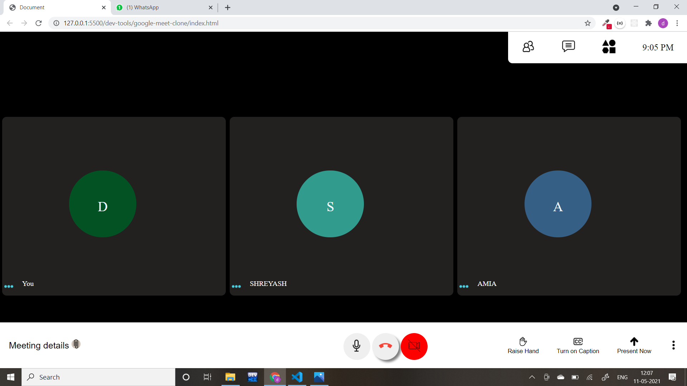
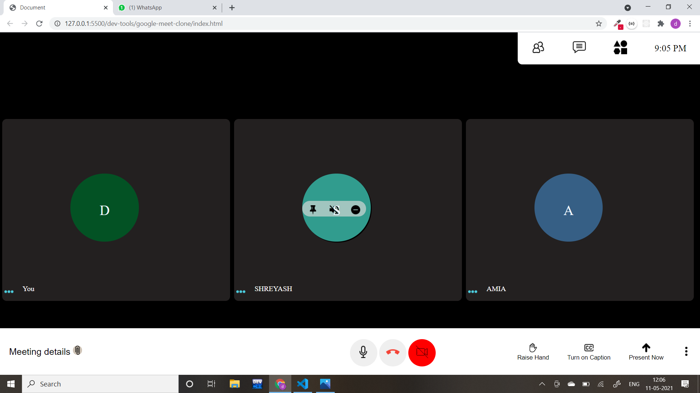

# Project for fun

## google-meet-clone

google-meet-ui-clone

### What I learned

- Some basic and advance CSS
- how to use flex
- about positioning

### What's in this

- I cretated those three buttons (operation buttons).
- they are mike, end call, and video buttons.
- for that i used flex so that they are aligned in a row with even space.
- And whenever you hover over them you can see the shadow with a slight delay.

### What's in this now

- On each tile that functionality to pin, mute and remove is given.
- It will rendered only when you hover on the avatar present at the center.
- Basically I added z-index of -1 originally to that div.
- But whenever anyone will hovers at that avatar z-index of that div becomes +1.
  -this cause to hide the functionality div when no one hover at avatar ,and pops up immediately whenever anyone hovers at it.

## Hope that was helpfull to usnderstand.
